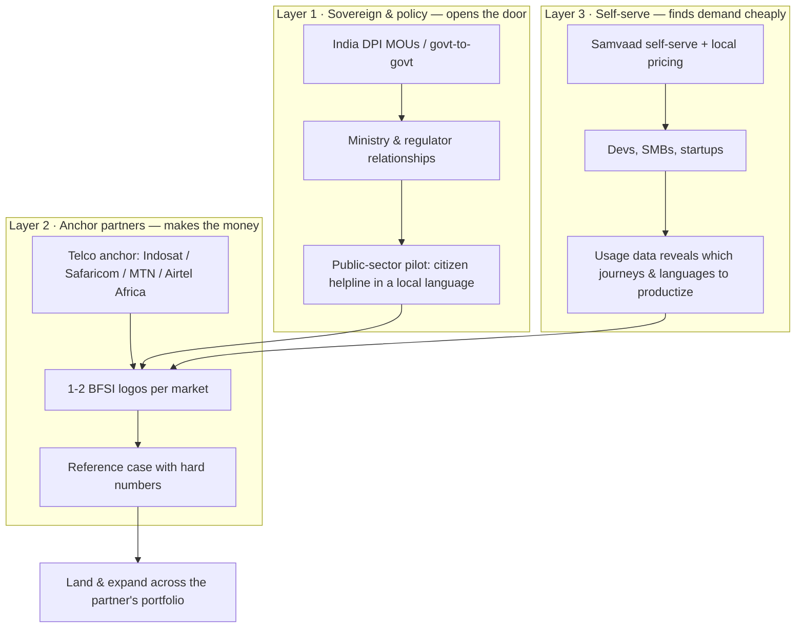

# Sarvam Global South Expansion — Market Analysis & GTM Plan

**Author:** Aryan · **For:** Sarvam AI — Co-founders & Lead PM · **Date:** July 2026

> ⚠️ **WRITTEN BEFORE VERIFICATION.** `sarvam-dossier.html` (Tab 04 + Tab 07) is the corrected source of truth. Key corrections: **(1)** there is no "October 2026" Indonesian compliance deadline — UU PDP has been fully enforceable since 17 Oct 2024; **(2)** the Indonesia BPO figures ($2.8B / 780–810k workers) came from one marketing blog — Mordor says $2.13B (2025) → $3.46B (2030); **(3)** WAXAL's 11,000 hrs is raw audio, usable is ~1,250–1,850 hrs transcribed, and "50+ languages" is unsupported; **(4)** Safaricom is 41M Kenya / 71M group, not 30M; **(5)** DPI MOUs = 23, not 24; **(6)** OPay has ~500k agents / 1M+ merchants, not 1.2M agents; **(7)** Nigeria's AI Strategy was **published Sept 2025**; **(8)** Kenya's AI policy is a **draft in consultation**; **(9)** Sarvam has **not** publicly stated an SEA/Africa expansion plan — present this as your proposal. **Never use a CEO title — both founders are "Co-founder."**
**Thesis in one line:** Sarvam's moat is not "AI for India" — it is **the only proven playbook for building sovereign voice AI in a poor, multilingual, voice-first, low-resource-language country.** That playbook is the export. India was the proof of concept; Indonesia and East Africa are the first two markets.

---

## 0. Executive summary

**The insight:** Every competitor treats language coverage as a feature. For Sarvam it's an operating system — data pipeline, edge deployment, sovereign compute, contact-centre-grade voice, and the political credibility to sell to governments. **There are ~40 countries with India's exact structural profile and zero credible domestic voice-AI stack.** Nobody is serving them as a *sovereignty enabler*. OpenAI and Google sell them a product; Sarvam can sell them a capability.

**What this plan is explicitly not:** a race against frontier labs. Sarvam doesn't win by out-benchmarking Claude, ChatGPT or the Chinese flagships — it wins on **local languages they will never prioritize, on devices they don't target, inside borders they can't enter.** (§1.5.)

**The recommendation:** A **three-market, 18-month sequence** — **Indonesia (beachhead) → Kenya/East Africa (DPI-led) → Nigeria (scale)** — entered not by direct enterprise sales, but through a **telco-anchor + DPI-diplomacy + self-serve** triple motion.

**The product to build:** not localized models — a **Language Onboarding Factory**: the repeatable pipeline that takes a new low-resource language from ~zero data to a production-grade voice agent. The self-improving eval loop is what makes that factory run without armies of local linguists. *That* is the exportable asset, and it compounds.

**Why now:** Indonesia's data-localization compliance deadline lands **October 2026**. Kenya's AI policy and Safaricom's very public AI-customer-service backlash are live *right now*. Sarvam has already stated it's exploring SLM export to Southeast Asia and Africa. This plan is the execution layer for a direction the company has already chosen.

---

## 1. Why voice + edge is genuinely a moat that travels

Three assets, and they compound only in markets that look like India:

| Asset | What it is | Why it doesn't travel *back* to the West |
|---|---|---|
| **Voice-first** | Saaras v3 (~19% WER, 22 languages, streaming), Bulbul TTS, Samvaad at 2M+ interactions/day; 500K+ hours transcribed monthly | The West is text-first and literate. Voice is a convenience there; in low-literacy, low-bandwidth markets it is *the only interface*. |
| **Edge / on-device** | Sarvam Edge: 74M-param ASR (~294MB), <300ms TTFT, 8.5× realtime on Snapdragon NPU; offline ASR+TTS+translation; **HMD/Nokia feature-phone partnership** with a dedicated AI button | Rich markets have bandwidth and flagship phones. Edge is a cost/coverage necessity precisely where Sarvam is aiming. |
| **Sovereign credibility** | Built under the IndiaAI Mission, trained on domestic compute, Apache-2.0 open weights, founder pedigree in national DPI (Aadhaar) | A US vendor structurally cannot offer sovereignty. This is Sarvam's single most defensible and least copyable asset. |

**The strategic reframe for the video:** Sarvam is not an Indian AI company. It is a **Global South AI company that happens to have started in India** — and India was the hardest possible first market (22 official languages, 700+ dialects, extreme price sensitivity, 800M+ users). Every subsequent market is easier.

---

## 1.5 The game we are *not* playing

**Sarvam is not competing with frontier labs — not Claude, not ChatGPT, not the Chinese flagships.** Any expansion plan that implies a benchmark race is the wrong plan, and I'd say so directly in the pitch.

| The frontier game (not ours) | The game Sarvam wins |
|---|---|
| Maximum reasoning on English/Chinese benchmarks | **Local languages nobody else will ever prioritize** |
| Trillion-param scale, billion-dollar training runs | **Small, cheap, distilled models that run on a ₹8,000 phone** |
| One global model served from US/China clouds | **Sovereign deployment inside the customer's borders** |
| Sell a product to a country | **Give a country the capability to build its own** |
| Win developers on capability | **Win telcos, banks and governments on compliance, cost, and reliability** |

**Why this is a stronger position, not a humbler one:**

1. **The frontier labs have no incentive to serve these languages.** Javanese, Sundanese, Swahili, Hausa, Yoruba, Pidgin, and 700+ Indonesian and 2,000+ African languages will never be where a frontier lab wins its benchmark. They're rounding errors on a global roadmap and the entire market for Sarvam. **Sarvam's ceiling is a competitor's rounding error.**

2. **Frontier scale is the wrong tool for this job anyway.** A voice agent handling an EMI query in Javanese on a 2G connection doesn't need a trillion parameters — it needs **sub-500ms latency, correct numbers, correct escalation, and a price near zero.** Sarvam's small-model discipline is a *feature* of serving poor multilingual markets, not a consolation for lacking compute.

3. **Where frontier models are genuinely better, use them.** Sarvam's own models are Apache-2.0 and the stack is provider-agnostic. If a customer wants a frontier LLM as the reasoning brain, **Sarvam sells the layer around it** — ASR, TTS, telephony-grade agents, edge deployment, sovereignty, and the accountability/eval loop. **The voice-and-language layer is the product; the brain is swappable.** That framing makes frontier progress a tailwind rather than a threat.

4. **Sovereignty is a structural moat, not a technical one.** No US or Chinese lab can credibly sell "your data, your borders, your models, your people trained" to Jakarta or Nairobi — geopolitics forbids it. **That advantage doesn't erode when GPT-6 ships.** Every other advantage in AI does.

**The one-sentence positioning I'd take into every market:**
> *We don't build the world's smartest model. We build the only stack that speaks your country's languages, runs on your citizens' phones, stays inside your borders — and can prove it worked.*

---

## 2. Market screening — how I chose

### 2.1 Screening criteria (weighted)

| # | Criterion | Weight | Why it predicts Sarvam's win-rate |
|---|---|---|---|
| 1 | **Language fragmentation & low-resource gap** | 20% | Where Sarvam's core competence is *most* differentiated vs. Google/OpenAI |
| 2 | **Sovereign-AI policy tailwind / data localization** | 20% | Regulation that makes a foreign hyperscaler legally awkward = a forced local buy |
| 3 | **Voice-first behaviour** (literacy, feature phones, connectivity) | 15% | Determines whether voice + edge is a nice-to-have or the only option |
| 4 | **Buyer density & ability to pay** (BFSI, telco, govt) | 20% | Revenue reality — the deals that fund the expansion |
| 5 | **India channel strength** (DPI MOUs, Indian corporates on the ground) | 15% | Warm entry vs. cold start; Sarvam's unfair advantage |
| 6 | **Competitive headroom** (inverse of Google/local entrenchment) | 10% | Where Sarvam isn't already outgunned |

### 2.2 Scored shortlist

Scores 1–5, weighted. My assessment, evidence-backed — the *reasoning* matters more than the decimals.

| Market | Lang. gap (20) | Sovereign policy (20) | Voice-first (15) | Buyers (20) | India channel (15) | Headroom (10) | **Total** |
|---|---|---|---|---|---|---|---|
| **🇮🇩 Indonesia** | 5 | 5 | 4 | 5 | 4 | 3 | **4.55** |
| **🇰🇪 Kenya / E. Africa** | 5 | 4 | 5 | 3 | 5 | 3 | **4.25** |
| **🇳🇬 Nigeria** | 5 | 3 | 5 | 4 | 3 | 2 | **3.75** |
| 🇵🇭 Philippines | 2 | 2 | 3 | 4 | 2 | 3 | 2.60 |
| 🇧🇩 Bangladesh | 3 | 3 | 5 | 2 | 5 | 4 | 3.45 |
| 🇿🇦 South Africa | 4 | 4 | 3 | 4 | 3 | 2 | 3.55 |
| 🇻🇳 Vietnam | 2 | 4 | 3 | 4 | 2 | 3 | 3.05 |
| 🇪🇬 Egypt | 3 | 3 | 4 | 3 | 2 | 3 | 3.00 |

**Rejected, and why — the discipline matters:**
- **Philippines** — high buyer density (BPO capital) but English-dominant. Sarvam's language moat evaporates; it becomes a pure price/latency fight against Vapi and ElevenLabs. *Wrong fight.*
- **Vietnam** — strong sovereign push, but essentially monolingual. Low fragmentation = low differentiation.
- **Bangladesh** — near-perfect structural fit and the strongest India channel, but thin enterprise ability-to-pay. **Keep as market #4** — cheap to serve once the factory exists.
- **South Africa** — 11 official languages and real budgets, but the most Western-integrated African market; Microsoft/Google are entrenched. Enter *later*, via the Nigeria/Kenya beachhead, not first.

---

## 3. Market #1 — Indonesia (beachhead)

### Why Indonesia is the correct first move
**It is the closest structural mirror of India on earth.** ~280M people, an archipelago of **700+ languages**, mobile-first, price-sensitive, with a state that has explicitly decided AI sovereignty is national policy. Everything Sarvam learned in India transfers with the *least* adaptation — and it's the highest-paying market on the shortlist.

**The four unlocks:**

1. **A regulatory forcing function with a date on it.** Indonesia's National AI Roadmap 2026–2029 targets a **$366B GDP contribution** and an explicit **sovereign AI fund**. Data localization (PP 71/2019; KOMINFO 5/2020) requires public-scope operators to store and process data **inside Indonesia**, with a compliance deadline of **October 2026** and penalties up to **2% of revenue**. Every regulated Indonesian institution needs a vendor that can deploy in-country. Sarvam already sells exactly this (private VPC / on-prem) because Indian BFSI demanded it.

2. **Language fragmentation nobody serves properly.** **Javanese ~84M speakers** (more than most European languages) and **Sundanese ~42M** — both dramatically under-served relative to speaker count. Bahasa Indonesia is the lingua franca, but customers *emote* in regional languages. This is the identical dynamic Sarvam solved for Hindi-vs-Tamil-vs-Marathi.

3. **A market that's already spending.** Contact-centre software: **$707.8M (2025), ~34.4% CAGR**. BPO/ITeS: **~$2.8B in 2026** with **780–810K workers**, contact centre being 42–48% of revenue. Banks are already deploying voice/chat assistants — **BRI's "Sabrina"**, **Mandiri's "MITA"/Livin'** — on foreign LLM stacks that are about to become a localization liability.

4. **The India door is already open.** As of 2026 India has DPI cooperation MOUs with **24 countries**, and **Indonesia is actively exploring India's DPI stack** (UPI, Aadhaar, DigiLocker, Account Aggregator) — reported **July 2026**. Sarvam's co-founder built Aadhaar's biometric systems. **That is the warmest possible introduction, and no competitor has it.**

### The competitive read — and the counter-intuitive move
Indonesia has a domestic champion: **Sahabat-AI** (70B, open-source, Bahasa + Javanese/Sundanese/Balinese/Bataknese, running on **Indosat's sovereign "Merdeka" GPU cloud**). Yellow.ai has **Komodo-7B** for regional languages.

**Do not fight Sahabat-AI. Power it.** Sahabat-AI is a *text* LLM on sovereign compute. Sarvam's differentiation is the **voice layer** — ASR, TTS, telephony-grade agents, edge — which is far harder to build and which Indonesia has *not* solved. The move is: **be the voice stack inside Indonesia's sovereign AI, not a competing brain.** This also neutralizes the "why an Indian vendor?" objection, because Sarvam is enabling their sovereignty rather than substituting for it.

> **The bridge nobody has spotted:** In **March 2026, Safaricom and Indosat signed an MOU** on AI/M-PESA frameworks. **One Indosat relationship is a warm path into Kenya's Safaricom.** Market #1 and market #2 are connected by a partner Sarvam would already have. This is the single highest-leverage relationship in the entire plan.

### Indonesia ICP & entry wedge
- **Primary ICP:** Tier-1 banks + digital banks (BRI, Mandiri, BCA; Superbank/Bank Jago) and multifinance lenders — collections, payment reminders, inbound support in Bahasa + Javanese/Sundanese.
- **Secondary:** telcos (Indosat, Telkomsel) for customer care; BPOs as a channel, not a competitor.
- **Wedge product:** *"Regional-language customer support that is legally allowed to run in Indonesia."* Compliance + languages Google serves poorly, at a price no US vendor will match.

---

## 4. Market #2 — Kenya / East Africa (DPI-led)

### Why Kenya second, not Nigeria
Kenya is smaller than Nigeria but it is **the highest-trust, lowest-friction African entry** — and it's where India's government channel is already built.

1. **The DPI MOU already exists.** Of India's DPI partner countries, **six are African: Kenya, Tanzania, Ethiopia, Sierra Leone, The Gambia, Lesotho.** Kenya is the most commercially developed of those. Sarvam enters as *part of an existing India–Kenya digital cooperation frame*, not as a cold foreign vendor.

2. **Policy is being written right now — Sarvam can shape it.** Kenya's **National AI Strategy 2025–2030**, the **Kenya AI & Emerging Technologies Policy (2026)**, a new **Kenya AI Safety Institute** to assess high-risk systems, and tightened rules on AI use of citizens' data. Data control is an explicit government priority. **Sovereignty is the buying criterion, and it is Sarvam's strongest card.**

3. **One anchor customer defines the whole market.** **Safaricom: 30M+ subscribers, ~150,000 customer-care calls/day, 100M+ M-PESA transactions/day.** Winning Safaricom effectively wins Kenya.

4. **A live, public pain point that Sarvam is uniquely positioned to fix.** Safaricom is being **sued over its AI customer service** — the core allegation being that customers are routed to the **Zuri** bot without reliable access to a human. This is not a story about AI being unwelcome. **It is a market screaming for voice agents that can prove they resolved the issue or escalated correctly.**

> **This is the direct commercial justification for my self-improving-agents project.** Task Success Rate, escalation-correctness as a hard scored metric, and a verifier gate on high-stakes turns are *exactly* the product Safaricom's situation demands. The technical project and the expansion plan are the same thesis: **accountable voice AI.**

### The African language reality — honest assessment
- **Hausa, Yoruba, Igbo, Swahili, Amharic, Kinyarwanda** have modest but usable datasets. **Most other African languages have <10 hours of usable audio** — vs. 50,000 hours for eight languages in Multilingual LibriSpeech. This gap is *worse* than anything in India.
- **Google's WAXAL (Feb 2026)** released **11,000+ hours across 21 Sub-Saharan languages** from ~2M recordings, built with Makerere and University of Ghana, **open-sourced with local ownership**. Google plans **50+ African languages**. MTN's **Miss Baza** already does voice-first AI on **feature phones**. **AethexAI** ($3M raised) handles **17,000+ calls/day**. Africa's conversational AI market is compounding at **~23% (2026–2032)**.

**The strategic call on Google:** WAXAL is a **gift, not a threat** — it's open source. Google is doing the expensive data collection and giving it away. Google's weakness is that it does not sell **sovereign, on-prem, contact-centre-grade voice agents to African banks and telcos with an accountability layer**. It sells search and assistant features. **Sarvam should consume WAXAL and compete on the deployment layer, where Google isn't playing.** Do not try to out-collect Google on data; out-execute them on production agents.

---

## 5. Market #3 — Nigeria (scale, entered third)

**Why third, despite being the biggest prize.** Nigeria has the largest voice-AI TAM in Africa: **Moniepoint processed ₦412T (~$294B) in 2025**; **OPay + PalmPay have 80M+ users**; **OPay runs a 1.2M-agent network**; lending is the new battleground (FairMoney, Kuda, Carbon), and **lending means collections — the single highest-ROI voice-agent use case.** Plus massive Hausa/Yoruba/Igbo/Pidgin fragmentation.

**But:** no dedicated AI Act yet (the National AI Strategy was still finalizing into 2026), FX volatility and repatriation risk, no India DPI MOU in the published six, and the most crowded local competitive set (**CallAI**, NDPA-compliant by design; Codewizards; Callybase). Entering Nigeria first means fighting on price with no policy tailwind and no warm channel.

**Enter Nigeria in month 12+, once the Language Factory has already shipped Swahili** — proving the pipeline works on an African language before spending on the harder market. Lead with **collections for lenders**, where ROI is arithmetic, not a story.

---

## 6. The product strategy — what actually gets built

### 6.1 The core asset: a Language Onboarding Factory
The mistake would be treating each market as a localization project. **Productize the pipeline instead.** Target: **a new language from near-zero to production voice agent in ~90 days.**

```
1. DATA         open corpora (WAXAL, Common Voice, Naija Voices, ALFFA)
                + telco partner audio + targeted field collection
2. BOOTSTRAP    cross-lingual transfer from Saaras v3's 22-language base
                (typologically similar languages first)
3. ADAPT        fine-tune ASR/TTS; code-switching is a first-class requirement,
                not an edge case (Swahili-English, Bahasa-Javanese, Naija Pidgin)
4. AGENTIFY     Samvaad templates for the 5 highest-value BFSI/telco journeys
5. EVALUATE     Task Success Rate + escalation-correctness on a local gold set
6. SELF-IMPROVE the closed loop (GEPA / memory / verifier gate) — this is what
                removes the linguist bottleneck and makes step 5 scale
7. HARDEN       edge distillation → offline on low-end phones & feature phones
```

**Steps 5–6 are the unlock.** Every competitor entering a new language needs expensive local experts to find out what's broken. If Sarvam's agents **diagnose and repair themselves against a measured objective**, the marginal cost of each new language collapses. **The self-improving loop is not a feature — it is the economic engine of the entire expansion.** That's the connective tissue between my two videos.

### 6.2 The data flywheel (the real moat)
Sarvam already transcribes **500K+ hours/month** in India. In a new market: deployments generate in-domain audio → improves ASR for that language → wins more deployments → competitors can't catch up because they don't have the calls. **Models get copied; flywheels don't.** Contract for the right to train on partner-anonymized audio from deal #1 — that term is worth more than the deal.

### 6.3 Edge as the leapfrog play
Feature phones and patchy networks are the norm across much of Africa. **MTN's Miss Baza proved voice-first AI on feature phones works.** Sarvam's **HMD/Nokia partnership — a dedicated AI button on a feature phone** — is directly portable to Africa, where Nokia/HMD's brand is strong. **This is the single most differentiated thing Sarvam can show an African telco or regulator**, and no US vendor is building for it.
> **Honest counterpoint to carry into the pitch:** Sarvam Edge has been criticized in India for requiring phones a large majority can't afford (Snapdragon-class NPUs). Expansion must fund a **genuinely low-end tier** — smaller distilled models, or **network-side edge** (agent runs at the telco edge, user is on any phone via a voice call). Say this out loud; it's more credible than pretending the constraint doesn't exist. **And it's the same technical spine as the AR-glasses roadmap** — sub-130ms on-device speech is exactly the glasses requirement.

---

## 7. Go-to-market — the three-layer motion

Direct enterprise sales from Bengaluru into Jakarta or Nairobi will fail: no trust, no local presence, 9–18 month procurement. Run three layers simultaneously, each feeding the next.



**Layer 1 — Sovereign (door-opener, low revenue, high leverage).** Ride the India DPI channel. Offer a **capability-transfer framing**: co-build the country's own voice models, local hosting, local staff trained. *"We are not selling you our AI. We are selling you the ability to build your own."* This is what India wanted from the world and never got — and it is a message OpenAI and Google structurally cannot deliver.

**Layer 2 — Anchor partners (the revenue engine).** One telco + one or two BFSI logos per market.
- **Telcos are the highest-leverage channel:** they own the phone numbers, the billing relationship, the call volume, and the government relationships.
- **The India-Africa unlock: Airtel Africa** — Bharti Airtel operates across ~14 African countries with an Indian parent, Indian leadership, and existing India-market familiarity with Sarvam's category. **The single warmest multi-country channel available**, and it does not require winning a foreign-owned incumbent first.
- **HCLTech** is now an investor with global enterprise relationships and has stated intent to build industry solutions on Sarvam's models and sell them internationally. **The channel already exists inside the cap table — use it.**

**Layer 3 — Self-serve (cheap discovery).** Samvaad's self-serve launch is a global distribution asset. Enable local currency + local numbers, then **read the usage data as a market-research instrument**: which languages and journeys people actually try tells you where to aim Layer 2.

### 7.1 Pricing
Sarvam's Indian pricing (STT ≈ ₹30/hour) is **an order of magnitude below Western voice-AI stacks** — the direct product of building for Indian price sensitivity. That's the weapon.
- **Undercut Western vendors 5–10×; do not undercut local vendors on price** — beat them on quality, compliance, and the accountability layer.
- Price **per successful outcome** where possible (resolved call / recovered payment), not per minute. It aligns with the TSR metric, it's a defensible differentiator, and only a company that *measures* task success can credibly offer it. **This is the pricing innovation the eval project makes possible.**
- Local currency billing; a sovereign/on-prem tier at a premium for regulated buyers.

---

## 8. 18-month execution roadmap

| Phase | Months | Focus | Key milestones | Success gate |
|---|---|---|---|---|
| **0 · Foundation** | 0–3 | Prove the factory | Language Factory pipeline documented & running; **Bahasa Indonesia + Javanese** ASR/TTS to target WER; eval harness localized | Bahasa TSR within 10% of Hindi baseline |
| **1 · Indonesia land** | 3–9 | Beachhead | Jakarta presence (2–3 local hires); Indosat/Sahabat-AI partnership; in-country deployment for localization compliance; **2 paying BFSI pilots**; self-serve live in IDR | 2 paid pilots + 1 signed enterprise contract |
| **2 · Kenya via DPI** | 6–12 | Second market | Ride India–Kenya DPI channel; **Swahili** through the Factory (validates African transfer); Safaricom conversation via the **Indosat bridge**; govt citizen-helpline pilot | Swahili agent in production + 1 telco/govt deal |
| **3 · Scale & Nigeria** | 12–18 | Expand | **Hausa/Yoruba/Pidgin**; Nigeria entry via lender **collections**; Airtel Africa multi-country channel; edge/feature-phone pilot with an African telco | 3 markets live; international = 15%+ of new ARR |

**Two decision gates I'd hold the team to:**
- **Month 9:** If Indonesia has no signed enterprise contract, the sovereign-partnership thesis is wrong — pivot to pure self-serve + BPO channel before spending on Africa.
- **Month 12:** If Swahili doesn't clear the Factory in ~90 days, the pipeline isn't productized. Fix the factory before adding markets. **Never enter market #3 on a broken factory.**

---

## 9. Metrics — how I'd run this as PM

| Layer | Metric | Why it's the right one |
|---|---|---|
| **North star** | **Non-India ARR as % of new ARR** | The only number that proves expansion is real, not theatre |
| Product | **Time-to-production for a new language** (target ≤90 days) | Directly measures whether the Factory is a product or a project |
| Product | **Task Success Rate per market/language** | Quality parity with India — the thing that makes references possible |
| Product | Ratio of self-improvement cycles run **without local linguist intervention** | Measures whether the economic engine actually works |
| Commercial | Anchor logos per market; pipeline sourced via partner vs. direct | Tests whether the channel thesis holds |
| Commercial | Gross margin by market (in-country compute is expensive) | Sovereignty costs money — watch it early |
| Flywheel | **In-market audio hours/month** ingested for training | The moat metric — is the flywheel spinning? |

---

## 10. Risk register (and mitigations)

| Risk | Severity | Mitigation |
|---|---|---|
| **Sovereignty cuts both ways** — Indonesia/Kenya prefer a *domestic* champion over an Indian vendor | **High** | The core positioning fix: **enable their sovereignty, don't replace it.** Be the voice layer inside Sahabat-AI; co-build, transfer capability, host locally, hire locally. Partner-first, never flag-first. |
| **Google commoditizes language data** (WAXAL 50+ languages, free) | Medium | **Consume it rather than compete with it.** Compete on the deployment, compliance and accountability layer where Google doesn't play. Moat = flywheel + agents, not the corpus. |
| **In-country compute destroys margins** | High | Partner with local sovereign clouds (Indosat Merdeka model) rather than building. Lead with **edge/on-prem**, where Sarvam's small models are a structural cost advantage. |
| **India brand friction / geopolitics** | Medium | Lead with the DPI cooperation frame and local entities; local leadership as the face of the market. |
| **FX, repatriation, payment friction (esp. Nigeria)** | Medium | Local-currency billing; sequence Nigeria third; partner-of-record structures. |
| **Distraction from the India core** | **High** | India is the profit engine — **ring-fence expansion as a small dedicated pod** with its own gates. Kill it at month 9 or 12 if gates fail. Say this to the CEO explicitly; it shows you understand focus is the scarcer resource. |
| **Quality gap in a new language damages the brand** | High | **Do not ship below the TSR bar.** The eval harness is the release gate — enforce parity before a logo goes live. |
| **Local incumbents move faster** (AethexAI, CallAI) | Medium | They can't match sovereign deployment, 22-language depth, edge, or price. Beat them to the *telco* anchors, which they're too small to win. |

---

## 11. What I'd want to be true (and how I'd test it in week 1)

Intellectual honesty for the video — these are assumptions, not facts, and here's how I'd validate them fast:

1. **Cross-lingual transfer from Indic → Austronesian/Bantu is strong enough** to hit useful WER without full-scale data collection. *Test:* fine-tune Saaras v3 on public Swahili and Bahasa corpora in week 1 and measure. **This is cheap, and it's the load-bearing assumption of the entire plan.**
2. **Sovereignty is a purchase criterion, not just rhetoric.** *Test:* 10 buyer interviews in Jakarta — does localization actually change the shortlist?
3. **Telcos will channel rather than build.** *Test:* the Indosat/Airtel Africa conversation directly.
4. **Per-outcome pricing is sellable.** *Test:* offer it in the first two pilots and see whether it accelerates or stalls procurement.

---

## 12. The ask

If I join, I'd own this as a **single-threaded PM for Global South expansion**: build the Language Onboarding Factory as a product, run the Indonesia beachhead to a signed contract in 9 months, and open Kenya through the DPI channel — with the self-improving eval loop as the engine that makes every new language cheaper than the last.

**The line I'd close the video on:** *India is 1.4 billion people. The Global South is 6 billion — and every one of those markets needs exactly what Sarvam already built, from someone who isn't trying to make them a customer of the West.*

---

## Sources

**Sarvam & products:** [Series B](https://www.sarvam.ai/announcing-series-b) · [Samvaad](https://www.sarvam.ai/products/conversational-agents) · [Sarvam Edge](https://www.sarvam.ai/products/edge) · [Edge explainer](https://www.analyticsvidhya.com/blog/2026/03/sarvam-edge/) · [Edge affordability critique](https://ucstrategies.com/news/indias-best-offline-ai-only-works-on-phones-80-of-indians-cant-afford/) · [Global GTM / SLM export to SEA & Africa](https://inc42.com/buzz/exclusive-sarvam-ai-to-open-voice-ai-agents-platform-for-public-use/) · [HCLTech $150M](https://www.techtimes.com/articles/318603/20260618/sarvam-ai-hits-15-billion-valuation-hcltech-bets-150-million-india-sovereign-ai.htm) · [Bosch pact](https://www.whalesbook.com/news/English/tech/Bosch-Sarvam-Forge-Sovereign-AI-Pact-for-India-and-Global-Markets/699f1c0204a25a58c8556271)

**Indonesia:** [National AI Roadmap 2026–2029 & sovereign fund](https://www.technotime.net/14806) · [Sovereign AI push](https://www.webpronews.com/indonesias-sovereign-ai-push-fund-roadmap-and-140b-gdp-goal-by-2030/) · [AI regulation & data localization 2026](https://www.pertamapartners.com/insights/indonesia-ai-regulations-2026) · [Contact-centre software market](https://www.kdmarketinsights.com/reports/indonesia-contact-center-software-market/8079) · [BPO statistics 2026](https://stealthagents.com/research/indonesia-bpo-industry-statistics-2026) · [Languages](https://asialocalize.com/blog/languages-spoken-in-indonesia/) · [Sahabat-AI / Indosat](https://www.telecomreviewasia.com/news/featured-articles/13799-sahabat-ai-empowers-indonesias-multilingual-nation/) · [Komodo-7B](https://tech.yellow.ai/p/komodo-7b-the-first-llm-for-regional) · [Bank Mandiri digital](https://gfmag.com/transaction-banking/bank-mandiri-building-the-digital-backbone-of-indonesias-economy/) · [Indonesia wants India's DPI](https://en.channeliam.com/2026/07/06/indonesia-india-digital-public-infrastructure-dpi/)

**Africa:** [Kenya National AI Strategy](https://bowmanslaw.com/insights/kenya-unveiling-of-the-national-ai-strategy-2025-2030-a-bold-step-into-the-future/) · [Kenya tightens AI data rules 2026](https://www.the-star.co.ke/news/2026-07-24-state-tightens-rules-on-ai-use-of-kenyans-data) · [Nigeria AI regulation & NDPA](https://digital.nemko.com/regulations/ai-regulation-in-nigeria) · [Nigeria National AI Strategy brief](https://tunanihq.org/assets/publication/Policy-Brief-NNAIS-Strategy-final.pdf) · [Safaricom sued over AI customer service](https://nation.africa/kenya/business/safaricom-sued-over-ai-use-in-customer-service-and-m-pesa-decisions-5433484) · [Safaricom–Indosat MOU](https://tech-ish.com/2026/03/18/safaricom-indosat-mou-mpesa-ai-frameworks/) · [Google WAXAL](https://techcabal.com/2026/02/12/voice-is-africas-gateway-to-ai-and-google-wants-to-lead-it/) · [WAXAL & AI sovereignty](https://restofworld.org/2026/google-waxal-african-languages-ai-sovereignty/) · [AethexAI $3M](https://dabafinance.com/en/news/aethexai-raises-3-million-voice-ai-africa-middle-east) · [Africa conversational AI market](https://www.6wresearch.com/market-takeaways-view/top-africa-conversational-ai-market-companies-with-market-size) · [African ASR low-resource review](https://arxiv.org/pdf/2510.01145) · [Feature-phone AI / Miss Baza](https://techafricanews.com/2026/01/15/leveraging-ai-to-bypass-the-smartphone-barrier-and-advance-digital-inclusion-in-africa/) · [Nigerian fintech scale](https://innovation-village.com/nigerias-fintech-six-how-moniepoint-opay-palmpay-kuda-carbon-and-fairmoney-have-fared-in-the-last-five-years-2021-2026/)

**India DPI channel:** [24-country DPI MOUs](https://www.biometricupdate.com/202602/indias-dpi-model-continues-global-expansion-with-23-country-partnerships) · [Six African countries adopt India's DPI](https://www.ecofinagency.com/news-digital/1202-52814-six-african-countries-adopt-india-s-digital-public-infrastructure-framework)
