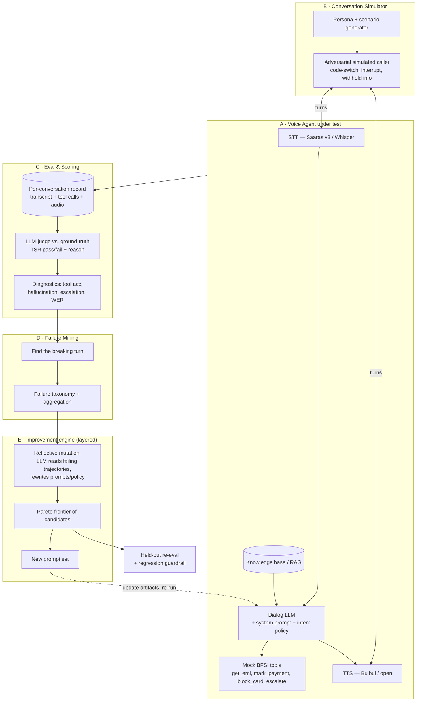
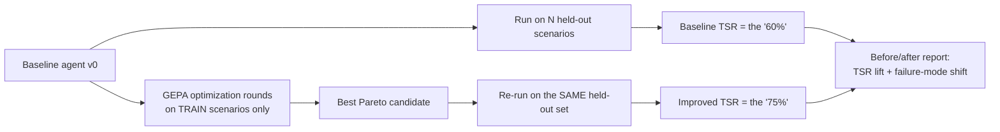

# Self-Improving Voice Agents — Project Plan & Architecture

**Author:** Aryan · **For:** Sarvam AI (AI Product Manager pitch) · **Date:** July 2026
**Demo anchor:** BFSI inbound **customer support** voice agent, Hindi/Hinglish
**One line:** A voice agent that scores whether it achieved each call's objective, finds the exact turn it broke, and rewrites its own instructions to do better — taking measured task success from a baseline to a clearly higher number, on held-out conversations, with no model retraining.

---

## 1. Why this, why now (the PM argument)

Sarvam's **Samvaad** runs 2M+ voice interactions/day and is about to open self-serve to thousands of SMBs and developers. Every one of those agents will be deployed by someone who *cannot* measure if it's working. The category-wide gap — true for Vapi, ElevenLabs, Bolna and Samvaad alike — is **proof of objective completion** and **automatic improvement from failure**. That's the reliability layer a sovereign voice platform serving BFSI, govt and defence structurally needs.

This project demonstrates I can own that layer end-to-end: **build the agent → define hard metrics → mine failures → make it self-improve** — solo, in Sarvam's exact problem space.

### Why BFSI customer support is the right anchor
- **Sarvam's #1 paying vertical.** Tata Capital already runs Samvaad on consumer-loan support. Banking/insurance is where the money and the stakes are.
- **A crisp, scoreable objective per call.** "Was the customer's actual issue resolved correctly, or correctly escalated, without giving wrong information?" → a clean pass/fail for Task Success Rate.
- **The richest failure surface for GEPA to fix:** wrong EMI/policy numbers (hallucination), intent misrouting, missing clarifying questions, wrong tool/args, failed fraud-escalation, code-mix breakdown. Lots for the optimizer to attack.
- **Regulated-grade stakes** make the metric design itself a PM artifact (hallucination and bad escalation get heavy penalties, not just a TSR ding).

---

## 2. The metric spine (what "achieved its objective" means)

**North-star: Task Success Rate (TSR)** — share of conversations where the agent met the call's ground-truth success condition. Industry production target is **85%+**; our job is to *move* it, honestly, on a held-out set.

Everything else is **diagnostic** — it explains *why* TSR is where it is:

| Category | Metric | Why it matters here |
|---|---|---|
| Outcome | **TSR**, Containment vs. correct-escalation, Turns-to-resolution | Did we actually help / hand off right? |
| Correctness | **Hallucination/compliance flags**, Tool-call accuracy (right tool + args) | Wrong EMI number or policy = automatic fail in BFSI |
| Speech | WER (audio mode), barge-in recovery, reprompt rate | Catches ASR-induced failures (Saaras's domain) |
| Experience | Sentiment trajectory, latency P50/P95 (simulated) | Quality signal, not the objective |

**Judge calibration is part of the design:** TSR is scored by an LLM-judge, so we validate the judge against a small human-labeled set and report its agreement rate. (Showing you know judges must be calibrated is itself a credibility signal to their team.)

---

## 3. System architecture

Six subsystems. The agent is the *thing under test*; the other five are the self-improvement machine around it.



### A. The Voice Agent (agent under test)
Cascaded pipeline that mirrors Samvaad, **provider-agnostic with a Sarvam adapter**:
- **STT:** Saaras v3 (Sarvam API) in the "Sarvam-native" config; Whisper/IndicConformer as a local fallback so the repo runs without keys.
- **Dialog LLM:** structured **system prompt + per-intent instructions + tool-use policy + escalation rules**. *These text artifacts are exactly what GEPA optimizes — no weight training.* Runs on Sarvam-M/105B in native mode, or an open model locally.
- **Tools:** mock BFSI backend (`get_emi`, `get_due_date`, `mark_payment`, `block_card`, `raise_ticket`, `escalate_to_human`) over synthetic accounts.
- **TTS:** Bulbul (Sarvam) / open.
- **Orchestration:** turn-taking, barge-in, cross-turn memory. Demo runs as a text+audio **simulation loop**, not real telephony.

### B. The Conversation Simulator (how we get scale without real call data)
- **Scenario generator:** produces diverse callers — language mix, mood, the *real underlying need*, and info they'll only reveal if asked — each paired with a **ground-truth success condition**.
- **Adversarial simulated caller:** an LLM role-plays the customer against the agent: interruptions, Hinglish code-switching, vagueness, frustration, off-topic detours. This is how Hamming/Cekura-style eval scales — and how we generate hundreds–thousands of conversations on demand.
- **Two fidelity modes:** *text-level* (fast, cheap, high volume) and *audio-level* (TTS the caller → run real STT → captures WER-induced failures).

### C. Eval & Scoring
- **TSR judge:** reads full transcript + scenario success condition → pass/fail + reason. Calibrated against human labels.
- **Diagnostics:** tool-call accuracy, hallucination/compliance flags, escalation correctness, turns-to-resolution, WER (audio mode), latency.
- **Output:** a structured per-conversation record — the dataset everything downstream runs on.

### D. Failure Mining ("where the model starts breaking")
- **Breaking-turn finder:** locate the first turn after which success became unreachable (judge-prompted + ablation cross-check).
- **Failure taxonomy:** ASR mis-transcription · intent misroute · missing clarifying question · wrong tool/args · hallucinated number/policy · failed/incorrect escalation · premature hangup · code-mix breakdown · repair-loop failure.
- **Aggregation:** which modes dominate (e.g., "38% intent misroute, 24% hallucinated EMI, 18% bad escalation"). *This is the PM insight that justifies the fix.*

### E. The improvement engine — a layered portfolio (no single "best" method)
Self-improvement isn't one algorithm; it's a stack of layers chosen by cost and risk. **GEPA is one layer, not the whole engine.** Full menu + comparison in `Self_Improvement_Methods_Landscape.md`. For this demo (no model retraining):
- **Prompt/instruction optimization — the primary driver:** **GEPA** (Genetic-Pareto reflective evolution — reads failing traces, rewrites the agent's prompts/policy, keeps a **Pareto frontier** so a fix for one intent doesn't break another), benchmarked head-to-head against **MIPROv2** (DSPy's Bayesian instruction+few-shot optimizer). Optimizes system prompt, per-intent instructions, tool-use guidance, escalation rules, few-shot examples. Shipped in DSPy/MLflow.
- **Memory — gains persist at runtime:** a **Reflexion/ExpeL "lessons learned"** store the agent consults, turning each failure into a heuristic without retraining.
- **Self-critique — runtime safety:** a **verifier gate** on high-stakes turns (Self-Refine / CRITIC-style) to kill hallucinated numbers and missed escalations *before* they execute.
- **Reward function (PM judgment lives here):** composite of TSR with **heavy penalties for hallucination and wrong escalation** — encodes regulated-industry priorities, not just raw success.
- **Guardrails:** optimize on train scenarios, measure on a **held-out set**; regression check; **human-approval gate** before "deploy."

**Roadmap layer (Sarvam-side, out of demo scope):** mine production into **KTO/DPO**, then **RLVR/GRPO** on Sarvam's own models — the *same* eval signal, now moving weights. Ties directly to Sarvam's existing RL muscle in the Saaras pipeline.

### F. Self-improving in production (the vision slide)
Close the loop continuously: live calls → auto-scored → failures mined nightly → GEPA proposes prompt updates → human-approved → shadow/A-B → promote. This is what *"make all of Sarvam's voice products self-improving"* means operationally — and it scales precisely with Samvaad's self-serve launch.

---

## 4. The 60% → 75% demonstration (done honestly)



- The lift is measured on **held-out** scenarios the optimizer never saw — otherwise the number is theater.
- Report not just TSR up, but **which failure modes shrank** (e.g., hallucinated-EMI 24% → 6%). That's the story that proves it's real improvement, not overfitting.
- **Honesty notes I will not fudge:** the demo runs hundreds–low-thousands of *simulated* conversations (architecture scales to millions; I won't claim millions I didn't run). Calls are simulated, not PSTN. The BFSI backend is mocked. This is exactly how production eval vendors operate, and saying so plainly is more credible than overclaiming.

---

## 5. Repo structure (architecture → code)

```
self-improving-voice-agent/
├── agent/
│   ├── adapters/sarvam/      # Saaras v3, Bulbul, Sarvam LLM
│   ├── adapters/open/        # Whisper, open LLM, open TTS (no-key fallback)
│   ├── prompts/              # ← the artifacts GEPA optimizes (versioned)
│   └── tools/                # mock BFSI tools + synthetic accounts
├── sim/                      # persona/scenario gen + adversarial caller
├── eval/                     # TSR judge, diagnostics, judge calibration
├── mining/                   # breaking-turn finder, taxonomy, aggregation
├── optimize/                 # GEPA (gepa/DSPy/MLflow), reward fn, Pareto
├── data/                     # scenarios, personas, run logs, labeled set
├── dashboard/                # the website: TSR-over-rounds, failure breakdown, transcript viewer
└── reports/                  # auto-generated before/after evidence
```

---

## 6. Four-week execution plan

| Week | Goal | Output |
|---|---|---|
| **1 — Agent + harness skeleton** | BFSI support agent (1 config), mock tools, simulation loop, transcript logging; ~30 hand-written gold scenarios | A sim caller talks to the agent; transcripts saved end-to-end |
| **2 — Eval + failure mining** | TSR judge + calibrate vs. ~50 human labels; diagnostics; breaking-turn finder; taxonomy; scale to 300–1000 scenarios | **The baseline number** + a ranked failure-mode breakdown |
| **3 — GEPA self-improvement** | Wire GEPA/MLflow; design reward fn; run optimization rounds; held-out re-eval; regression checks | **The improved number** + before/after failure shift |
| **4 — Package + tell the story** | Dashboard/website, repo + README polish, 10-min build video, "why Sarvam" video + 3 product ideas/flowcharts | Shippable repo, live site, 2 videos; CEO/PM names confirmed |

---

## 7. What this proves to Sarvam

- **Range:** implement a voice agent, define hard metrics, diagnose failures, and make it self-improve — the full AI-PM-who-can-build loop, solo.
- **Fit:** Indian-language, BFSI, Samvaad-shaped, sovereign (runs on open/edge models), and it's exactly the reliability layer their self-serve scale demands.
- **Runway to the AR/glasses thesis:** Sarvam **Edge** + a self-improving on-device agent is the seed of "the iPhone of glasses" — the subject of pitch video #2.

## 8. Open items to close before the pitch
1. Confirm **CEO vs. co-founder** titles (Pratyush Kumar / Vivek Raghavan).
2. Find the **Lead PM's** name + background.
3. Check whether Samvaad already ships any eval/observability — if so, position as *augment*, not *replace*.
4. Get Sarvam API keys if you want the "Sarvam-native" config live in the demo (else ship on open models + a Sarvam adapter).

---
*Companion file: `Sarvam_Voice_Intel_2026.md` (the research this plan is built on).*
